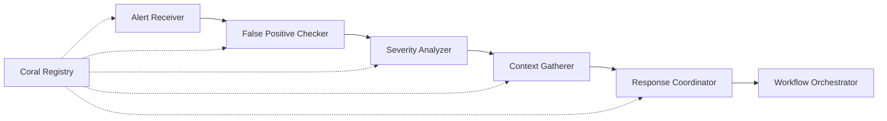

# Alert Triage System

**Intelligent security alert triage using Coral Protocol multi-agent AI architecture**

[](https://opensource.org/licenses/MIT)
[](https://www.python.org/downloads/)
[](https://www.docker.com/)
[](https://kubernetes.io/)

## 🎯 Overview

The Alert Triage System is a production-ready, intelligent security alert processing platform that uses the Coral Protocol to coordinate multiple AI agents for automated security alert analysis. The system transforms traditional manual alert triage into an adaptive, intelligent workflow that learns and improves over time.

### Key Features

- **🤖 Multi-Agent Architecture**: Uses Coral Protocol for secure agent coordination
- **🔍 Intelligent Analysis**: Automated false positive detection, severity analysis, and context gathering
- **⚡ Real-time Processing**: Webhook-based alert ingestion from any security tool
- **🧠 Adaptive Learning**: Agents learn from outcomes and adapt their decision-making
- **🔗 Seamless Integration**: Native support for SIEM, SOAR, and threat intelligence platforms
- **📊 Comprehensive Monitoring**: Built-in metrics, logging, and health monitoring
- **🚀 Cloud-Native**: Docker and Kubernetes ready with horizontal scaling
- **🔒 Security-First**: End-to-end encryption, audit logging, and compliance features

## 🏗️ Architecture

The system implements a 5-step alert triage workflow using specialized agents:



### Agent Responsibilities

| Agent | Purpose | Key Capabilities |
|-------|---------|------------------|
| **Alert Receiver** | Normalizes incoming alerts | Multi-format support, validation, routing |
| **False Positive Checker** | Identifies false positives | Rule-based + ML analysis, confidence scoring |
| **Severity Analyzer** | Determines alert severity | Multi-factor analysis, risk scoring |
| **Context Gatherer** | Enriches with threat intel | TI queries, user/network context, historical analysis |
| **Response Coordinator** | Determines response actions | SOAR integration, automation, escalation logic |
| **Workflow Orchestrator** | Manages overall workflow | Progress tracking, error handling, optimization |

## 🚀 Quick Start

### Prerequisites

- Python 3.11+ 
- Docker and Docker Compose (recommended)
- 4GB+ RAM, 2+ CPU cores

### Option 1: Docker Compose (Recommended)

```bash
# Clone the repository
git clone https://github.com/ZuhairKhan123/alert-triage-system.git
cd alert-triage-system

# Start the complete stack
docker-compose up -d

# Check system health
curl http://localhost:8080/health
```

### Option 2: Local Development

```bash
# Install dependencies
pip install -r requirements.txt

# Run the demo
python src/main.py demo

# Or run production mode
python src/main.py
```

### Option 3: Kubernetes

```bash
# Deploy to Kubernetes
kubectl apply -f deployment/kubernetes/

# Check deployment status
kubectl get pods -n alert-triage
```

## 📖 Usage Examples

### Submitting Alerts via Webhook

```bash
# Generic alert webhook
curl -X POST http://localhost:8080/webhook/alert \
  -H "Content-Type: application/json" \
  -d '{
    "alert_id": "ALT-001",
    "timestamp": "2024-01-15T10:30:00Z",
    "source_system": "Splunk",
    "type": "brute_force",
    "description": "Multiple failed login attempts detected",
    "source_ip": "203.0.113.45",
    "user_id": "admin_user"
  }'

# Splunk-specific webhook
curl -X POST http://localhost:8080/webhook/splunk \
  -H "Content-Type: application/json" \
  -d '{
    "result": {
      "sid": "splunk_123456",
      "_time": "2024-01-15T10:30:00Z",
      "search_name": "Brute Force Detection",
      "src_ip": "203.0.113.45",
      "user": "admin_user"
    }
  }'
```

### Monitoring Workflows

```bash
# Get system metrics
curl http://localhost:8080/metrics

# Check workflow status
curl http://localhost:8081/api/v1/workflows/{workflow_id}

# View system health
curl http://localhost:8080/health
```

### Python API Usage

```python
import asyncio
from src.main import AlertTriageSystem

async def process_alert():
    # Initialize system
    system = AlertTriageSystem()
    await system.initialize()
    
    # Process alert
    alert_data = {
        "alert_id": "DEMO-001",
        "type": "malware",
        "description": "Suspicious file detected",
        "source_ip": "10.0.0.100"
    }
    
    workflow_id = await system.process_alert(alert_data)
    print(f"Processing alert: {workflow_id}")
    
    # Get results
    await asyncio.sleep(5)
    status = await system.get_workflow_status(workflow_id)
    print(f"Status: {status}")

asyncio.run(process_alert())
```

## ⚙️ Configuration

### Environment Variables

```bash
# Core settings
ENVIRONMENT=production
LOG_LEVEL=INFO
CONFIG_PATH=config/production.yaml

# Security
WEBHOOK_SECRET=your-webhook-secret
JWT_SECRET=your-jwt-secret
API_KEY_REQUIRED=true

# External integrations
SIEM_ENDPOINT=https://your-splunk.com
SIEM_API_KEY=your-siem-key
SOAR_ENDPOINT=https://your-soar.com
SOAR_API_KEY=your-soar-key

# Database
REDIS_HOST=localhost
REDIS_PASSWORD=your-redis-password
POSTGRES_HOST=localhost
POSTGRES_PASSWORD=your-postgres-password
```

### Configuration File

The system uses YAML configuration files with environment variable substitution:

```yaml
# config/production.yaml
agents:
  false_positive_checker:
    confidence_threshold: 0.8
    enable_ml_analysis: true
    
integrations:
  siem:
    enabled: true
    endpoint: ${SIEM_ENDPOINT}
    api_key: ${SIEM_API_KEY}
    
security:
  api_key_required: ${API_KEY_REQUIRED:true}
  webhook_secret: ${WEBHOOK_SECRET}
```

## 🔗 Integrations

### SIEM Platforms

- **Splunk**: Native webhook support with search result parsing
- **IBM QRadar**: Offense-based alert processing
- **Microsoft Sentinel**: Incident webhook integration
- **Generic**: Standard REST/webhook interface

### SOAR Platforms

- **Phantom/SOAR**: Automated incident creation and playbook execution
- **Demisto/XSOAR**: Case management integration
- **Resilient**: Incident tracking and response coordination
- **Swimlane**: Workflow automation and case management

### Threat Intelligence

- **VirusTotal**: File hash and IP reputation checking
- **MISP**: Threat intelligence sharing and correlation
- **AlienVault OTX**: Open threat intelligence feeds
- **Custom TI**: REST API integration for proprietary feeds

## 📊 Monitoring & Observability

### Metrics (Prometheus)

- Alert processing rates and latencies
- Agent performance and queue sizes
- Workflow success/failure rates
- False positive detection accuracy
- System resource utilization

### Dashboards (Grafana)

- Real-time alert processing overview
- Agent performance analytics
- Workflow execution timelines
- Security operations metrics
- System health monitoring

### Logging (Structured)

- Security audit trails
- Performance timing data
- Error tracking and debugging
- Agent communication logs
- API access logs

## 🔒 Security Features

### Agent Security

- **Authenticated Communication**: All agent messages are authenticated
- **Message Encryption**: End-to-end encryption for sensitive data
- **Capability-Based Access**: Agents only access required capabilities
- **Audit Logging**: Complete audit trail of all agent actions

### API Security

- **Webhook Signature Validation**: HMAC-SHA256 signature verification
- **Rate Limiting**: Configurable request rate limits
- **JWT Authentication**: Token-based API access control
- **CORS Protection**: Cross-origin request security

### Data Protection

- **Encryption at Rest**: Sensitive data encrypted in storage
- **TLS/SSL**: All network communication encrypted
- **Secrets Management**: Secure handling of API keys and credentials
- **Data Retention**: Configurable data retention policies

## 🎛️ Advanced Features

### Machine Learning

- **False Positive Models**: Trained ML models for FP detection
- **Severity Prediction**: ML-based severity scoring
- **Behavioral Analysis**: User and network behavior modeling
- **Continuous Learning**: Models update based on analyst feedback

### Workflow Optimization

- **Dynamic Routing**: Intelligent routing based on alert characteristics
- **Load Balancing**: Automatic load distribution across agents
- **Circuit Breakers**: Fault tolerance and graceful degradation
- **Performance Tuning**: Automatic workflow optimization

### Compliance & Reporting

- **Audit Trails**: Complete processing history for compliance
- **SLA Monitoring**: Processing time and success rate tracking
- **Custom Reports**: Configurable reporting for stakeholders
- **Data Export**: Integration with GRC and reporting tools

## 🐳 Deployment Options

### Development

```bash
# Local development with hot reload
docker-compose -f deployment/docker/docker-compose.yml up

# Run tests
pytest tests/ -v --cov=src/
```

### Production

```bash
# Production deployment with scaling
docker-compose -f deployment/docker/docker-compose.prod.yml up -d

# Or use Kubernetes
kubectl apply -f deployment/kubernetes/
```

### Cloud Deployment

- **AWS**: EKS deployment with RDS and ElastiCache
- **Azure**: AKS with Azure Database and Redis Cache
- **GCP**: GKE with Cloud SQL and Memorystore
- **Multi-Cloud**: Terraform modules for cross-cloud deployment

## 📈 Performance & Scaling

### Performance Characteristics

- **Throughput**: 1000+ alerts/minute per instance
- **Latency**: <30 seconds average processing time
- **Scalability**: Horizontal scaling to 100+ instances
- **Availability**: 99.9% uptime with proper deployment

### Scaling Guidelines

| Component | Scaling Factor | Resource Requirements |
|-----------|---------------|----------------------|
| Alert Receivers | CPU-bound | 1 CPU per 500 alerts/min |
| ML Agents | Memory-bound | 2GB RAM per instance |
| Context Gatherers | I/O-bound | High network bandwidth |
| Database | Storage-bound | SSD storage, connection pooling |

## 🧪 Testing

### Unit Tests

```bash
# Run unit tests
pytest tests/unit/ -v

# With coverage
pytest tests/unit/ --cov=src/ --cov-report=html
```

### Integration Tests

```bash
# End-to-end workflow tests
pytest tests/integration/ -v

# Performance tests
pytest tests/performance/ -v --benchmark-only
```

### Load Testing

```bash
# Webhook load testing
scripts/load_test.sh 1000 10  # 1000 requests over 10 seconds

# Agent performance testing
python tests/performance/benchmark_agents.py
```

## 🤝 Contributing

We welcome contributions! Please see our [Contributing Guide](CONTRIBUTING.md) for details.

### Development Setup

```bash
# Fork and clone the repository
git clone https://github.com/ZuhairKhan123/alert-triage-system.git

# Install development dependencies
pip install -r requirements-dev.txt

# Install pre-commit hooks
pre-commit install

# Run tests
make test

# Format code
make format
```

### Code Standards

- **Python**: Follow PEP 8, use Black for formatting
- **Documentation**: Comprehensive docstrings and README updates
- **Testing**: Maintain >90% test coverage
- **Security**: Security review for all changes

## 📄 License

This project is licensed under the MIT License - see the [LICENSE](LICENSE) file for details.

## 🆘 Support

- **Documentation**: [docs/](docs/)
- **Issues**: [GitHub Issues](https://github.com/ZuhairKhan123/alert-triage-system/issues)
- **Discussions**: [GitHub Discussions](https://github.com/ZuhairKhan123/alert-triage-system/discussions)
- **Security**: [SECURITY.md](SECURITY.md)

## 🗓️ Roadmap

### Q1 2024
- [ ] Advanced ML models for threat classification
- [ ] GraphQL API support
- [ ] Enhanced SOAR integrations

### Q2 2024
- [ ] Real-time threat hunting capabilities
- [ ] Advanced analytics and reporting
- [ ] Multi-tenant architecture

### Q3 2024
- [ ] Natural language query interface
- [ ] Automated playbook generation
- [ ] Advanced compliance reporting

---

**Built with ❤️ using Coral Protocol and modern AI architectures**

For questions or support, please open an issue or start a discussion in our GitHub repository.